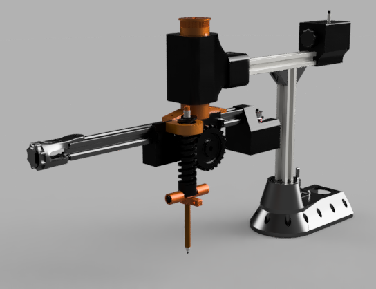

# Prismatic-SCARA

## Archivos Importantes

- **animation_ik2.py**: Este archivo contiene un diagrama simplificado del movimiento del SCARA prismático en el espacio. Se pueden observar los ejes y probar distintos puntos factibles.

- **ik2_serialcontrol.py**: Este archivo se ejecuta para mover el manipulador entre dos puntos y se comunica directamente con el ARDUINO usando el archivo (o clase de Python) `SerialControl.py`.

- **SCARAprismatico.ino**: Este archivo de Arduino está en la carpeta `arduino_code`.
